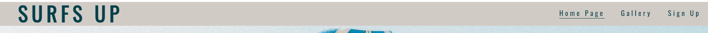

# Surfs Up
(Developer: Kieran Merrett)

[Live webpage](https://kiemerr17.github.io/surfs-up/index.html)

## Table of Content

1. [Project Goals](#project-goals)
    1. [User Goals](#user-goals)
    2. [Site Owner Goals](#site-owner-goals)
2. [User Experience](#user-experience)
    1. [Target Audience](#target-audience)
    2. [User Requrements and Expectations](#user-requrements-and-expectations)
    3. [User Stories](#user-stories)
3. [Design](#design)
    1. [Design Choices](#design-choices)
    2. [Colour](#colours)
    3. [Fonts](#fonts)
    4. [Structure](#structure)
    5. [Wireframes](#wireframes)
4. [Technologies Used](#technologies-used)
    1. [Languages](#languages)
    2. [Frameworks & Tools](#frameworks-&-tools)
5. [Features](#features)
6. [Testing](#validation)
    1. [HTML Validation](#HTML-validation)
    2. [CSS Validation](#CSS-validation)
    3. [Accessibility](#accessibility)
    4. [Performance](#performance)
    5. [Device testing](#performing-tests-on-various-devices)
    6. [Browser compatibility](#browser-compatability)
    7. [Testing user stories](#testing-user-stories)
8. [Bugs](#Bugs)
9. [Deployment](#deployment)
10. [Credits](#credits)
11. [Acknowledgements](#acknowledgements)

## Project Goals 

### User Goals
- Find a surf school in the Siargao area.
- See exactly what the business offers.
- Find information about the type of lessons available
- Find the location of the surf school

### Site Owner Goals
- See an increase in the number of customers.
- Provide information about the bussines to customers.
- Provide a way for new and existing customers to contact the buissnes.
- Promote the bussiness.

## User Experience

### Target Audience
- People looking for surf lessons in Siargao
- People looking for 1-2-1 surf coaching
- Groups of people looking for surf lessons
- Surfers looking to see the forecast for the surf this week.

### User Requrements and Expectations

- A easy and simple navigation system
- Easy access to relevant information
- All links and functions to work as expected
- A fully responsive design across all screen sizes
- Information about how to contact the business
- A design which is appealing to the eye

## User Stories

#### First-time User 
1. As a first time user, I want to know where the surf school is located
2. As a first time user, I want to know the type of training available
3. As a first time user, I want to know the history of the surf school
4. As a first time user, I want to get a feel for what to expect during my training

#### Returning User
5. As a returning user, I want to see the forecast for this weeks surfing
6. As a returnign user, I want to know the opening times
7. As a returning user, I want to be able to sign up to some surfing
8. As a returning user, I want to be able to email the company
9. As a returning user, I want to find the surf school on social media
10. As a returning user, I want to know who my instructors are
11. As a returning user, I want to get directions to the surf school

#### Site Owner 
12. As the site owner, I want users to be able to see photographic evidence of our training
13. As the site owner, I want users to know the history of the surf school
14. As the site owner, I want the users to be able to contact us or come for a visit

## Design

### Design Choices
The webpage was designed with a simplicity feel to give the user a quick and easy navigation to specific sections for relevant information.

### Colour
For the colour scheme i used sandy tones and deep blues to give the same feel you would expect to have being on a beach or in the water.tones were chosen to match the images on the page and also the colour theme of the actual restaurant. My inspiration for the colors was taken from a Pintrest colour pallet which i felt delivered just what i was looking for. The colors were given in basic '#' color codes but i converted them to RGB and RGBA to give some areas some opacity.
 

### Fonts
Oswald Font was used across the page to match in with the simplicity feel i was looking to acheive in the design period.
 
Sans-serif was used as a back-up font should Oswald not be available.

### Structure
The page is structured in a well know, recognizable, user friendly, and easy to learn way. When arriving to the website the user sees a familiar type of navigation bar with the company name on the left side and the navigation links to the right. 

The website consists of three separate pages: 
- A Home Page with a section to give information about the company, lesson types we offer and also the surf forecast for this week.
- A Gallery page with images to display content from previous lesson where photos were taken.
- A Sign Up page with a sign-up form, a map along with information about how and where to contact the business.

### Wireframes

Home Page

Gallery

Sign Up

## Technologies Used

### Languages
- HTML
- CSS

### Frameworks & Tools
- GitHub
- Gitpod
- Balsamiq
- Google Fonts
- Pintrest
- Font Awsome
- Favicon.io

## Features
The page consists of three pages and fourteen features

### Logo and Navigation Bar
- Featured across all three pages
- The navbar is fully responsive and changes to a toggler (hamburger menu) on smaller screens and includes
links to the Home Page, Gallery and Sign Up page
- This helps the user easily navigate through the pages
- The link for the page the user is currently on is underlined 

### About Us
- Alows users to see history of the surf school and about the surf instructors
- User stories covered: 3, 10, 13

### What We Offer
- Alowes users to see the type of traing lssons we offer.
- User stories covered: 2

### Surf Locations
- This gives the user a overlook for the week ahead surfing, its conditions (given in a start rating) and how many spaces are available for training that day.
- User stories covered: 5

### Footer
- Featured across all three pages
- It holds four seperate icons which link to social social media.
- User stories covered: 4, 9, 10, 12, 13

### Image Gallery
- Images take at the surf school during lessons
- User stories covered: 4, 12, 13

### Sign Up form
- A way for user to signup to the training we offer.
- User stories covered: 7

### Map
- Shows the rsurf schools location on a Google Map
- User stories covered: 1, 11 14

### Contact Us
- Gives the user information about the surf school including address, email, and opening times.
- User stories covered:1, 6, 8, 11, 14

## Validation

### HTML Validation
The W3C Markup Validation Service was used to validate the HTML of the website. All pages pass with no errors no warnings to show.

Home Page

Gallery

Sign Up

 

### CSS Validation
The W3C Jigsaw CSS Validation Service was used to validate the CSS of the website.
When validating the page as a whole it passes with no errors found.

whole page

style.css

 

### Accessibility
The WAVE WebAIM web accessibility evaluation tool was used to ensure the website met high accessibility standards. All pages pass with 0 errors.

Home Page

Gallery

Sign Up

 

### Performance 
Google Lighthouse in Google Chrome Developer Tools was used to test the performance of the website. 

Home Page

Gallery

Sign Up

 

### Performing tests on various devices 
I've tested my website on the following devices:
- Huawei Mate pad Pro (both in pc and tablet mode)
- Iphone 12
- Dell G3 Laptop

I also tested the site using Google Chrome Developer Tools, adjusting for all available devices.

### Browser compatability
The website was tested on the following browsers:
- Google Chrome
- Microsoft Egde

### Testing user stories

1. As a first time user, I want to know where the surf school is located

| **Feature** | **Action** | **Expected Result** | **Actual Result** |
|-------------|------------|---------------------|-------------------|
| Map | Navigate to the Contact Us page, locate the Google Map | Locating a map showing the location of the restaurant | Works as expected |
| Contact Us - contact information section | On Home Page scroll down to the Contact Us section | Find the address of the surf school along with opening times | Works as expected |

Screenshots

2. As a first time user, I want to know the price range

| **Feature** | **Action** | **Expected Result** | **Actual Result** |
|-------------|------------|---------------------|-------------------|
| Menu | Navigate to the Menu page | See prices on menu page | Works as expected |

Screenshots

3. As a first time user, I want to know more about the restaurant

| **Feature** | **Action** | **Expected Result** | **Actual Result** |
|-------------|------------|---------------------|-------------------|
| About Us | Navigate to the About page and locate the About Us section | Find description of the restaurant | Works as expected |
| Customer reviews | Navigate to the About page, scroll down to What our guests say section | Read customer reviews | Works as expected | 

Screenshots

4. As a first time user, I want to get a feel of what to expect at the restaurant

| **Feature** | **Action** | **Expected Result** | **Actual Result** |
|-------------|------------|---------------------|-------------------|
| Gallery | Navigate to the Gallery page | Find pictures of the restaurant and food served there | Works as expected |
| Promo video | Navigate to the GAlelry page and scroll to the promo video | Watch promo video | Works as expected |

Screenshots

5. As a returning user, I want to see the Sunday meal offer

| **Feature** | **Action** | **Expected Result** | **Actual Result** |
|-------------|------------|---------------------|-------------------|
| Meal-deal | On home page scroll down to the Sunday meal deal section | Find the meal-deal for the upcomming Sunday | Works as expected |

Screenshots

6. As a returnign user, I want to know the opening times

| **Feature** | **Action** | **Expected Result** | **Actual Result** |
|-------------|------------|---------------------|-------------------|
| Footer - opening times section | On any page scroll to the footer | See opening times | Works as expected |

Screenshots

7. As a returning user, I want to find a phone number to call for reservation

| **Feature** | **Action** | **Expected Result** | **Actual Result** |
|-------------|------------|---------------------|-------------------|
| Footer - contact information section | On any page scroll to the footer | See phone number | Works as expected |
| Info Box | Navigate to Contact Us page and locate the How to find us section | See phone number | Works as expected |

Screenshots

8. As a returning user, I want to see the menu

| **Feature** | **Action** | **Expected Result** | **Actual Result** |
|-------------|------------|---------------------|-------------------|
| Menu | Navigate to the menu page | Read the menu | Works as expected |

Screenshots

9. As a returning user, I want to leave some comment, suggestion or message to the staff

| **Feature** | **Action** | **Expected Result** | **Actual Result** |
|-------------|------------|---------------------|-------------------|
| Contact Form | Navigate to the Contact Us Page and locate the contact form, fill out and submit contact form | Data submited via contact form | Works as expectd |

Screenshots

10. As a returning user, I want to find the restaurant on social media

| **Feature** | **Action** | **Expected Result** | **Actual Result** |
|-------------|------------|---------------------|-------------------|
| Footer - social media section | On any page scroll to the bottom | Click on social media links | Works as expected | 

Screenshots

11. As a returning user, I want to know who is preparing the food

| **Feature** | **Action** | **Expected Result** | **Actual Result** |
|-------------|------------|---------------------|-------------------|
| Meet the Chef | Navigate to the About page and scroll down to Meet the Chef section | Find brief bio of the Chef | Works as expected |

Screenshots

12. As a returning user, I want to get directions to the restaurant

| **Feature** | **Action** | **Expected Result** | **Actual Result** |
|-------------|------------|---------------------|-------------------|
| Map | Navigate to the Contact Us page, locate the map and click on directions link | See directions to the restaurant on Goole Maps | Works as expected |

Screenshots

13. As the site owner, I want users to find news about upcoming events or changes in opening times

| **Feature** | **Action** | **Expected Result** | **Actual Result** |
|-------------|------------|---------------------|-------------------|
| News | Scroll down on home page and locate news section | Find latest news | Works as expected |

Screenshots

14. As the site owner, I want users to get to know the restaurant 

| **Feature** | **Action** | **Expected Result** | **Actual Result** |
|-------------|------------|---------------------|-------------------|
| About Us | Navigate to About page and locate About Us section | See relevant information about the restaurant | Works as expected |

Screenshots

15. As the site owner, I want the users to be able to contact us

| **Feature** | **Action** | **Expected Result** | **Actual Result** |
|-------------|------------|---------------------|-------------------|
| Contact Form | Navigate to the Contact Us Page and locate the contact form, fill out and submit contact form | Data submited via contact form | Works as expectd |
| Info Box | Navigate to Contact Us page and locate the How to find us section | Find the phone number | Works as expected |
| Footer - contact information section | On any page scroll down to the footer | Find the phone number | Works as expected |

Screenshots

## Bugs

| **Bug** | **Fix** |
| ----------- | ----------- |
| Home page link stays highlighted when visiting another page | Change active atribute to the correct page |
| The user can submit a contact form input without a message | Add required attribute to message input field |
| Navbar divides into two rows on xs screen size | Add a media query to remove the right margin of the logo in the navbar on xs screen |
| Email overflows on xs screen size | Add a media query that makes the divs spread to 100% width on xs sreens to froce the content onto a seperate line |
| When viewed on tablets, the contact page has whitespace after the footer | Set min-height for body to 100vh |

## Deployment
The website was deployed using GitHub Pages by following these steps:
1. In the GitHub repository navigate to the Settings tab
2. On the left hand menu select Pages
3. For the source select Branch: master
4. After the webpage refreshes automaticaly you will se a ribbon on the top saying: "Your site is published at https://4n4ru.github.io/CI_MS1_BodelschwingherHof/"

You can for fork the repository by following these steps:
1. Go to the GitHub repository
2. Click on Fork button in upper right hand corner

You can clone the repository by following these steps:
1. Go to the GitHub repository 
2. Locate the Code button above the list of files and click it 
3. Select if you prefere to clone using HTTPS, SSH, or Github CLI and click the copy button to copy the URL to your clipboard
4. Open Git Bash
5. Change the current working directory to the one where you want the cloned directory
6. Type git clone and paste the URL from the clipboard ($ git clone https://github.com/YOUR-USERNAME/YOUR-REPOSITORY)
7.Press Enter to create your local clone.

## Credits
Images not referenced below are owned by the developer.

### Media
In order of apearance:
- [carousel-1](assets/images/carousel-1.jpg): Photo by <a href="https://unsplash.com/@heathergill?utm_source=unsplash&utm_medium=referral&utm_content=creditCopyText">Heather Gill</a> on <a href="https://unsplash.com/s/photos/pots-and-pans?utm_source=unsplash&utm_medium=referral&utm_content=creditCopyText">Unsplash</a>
- [news](assets/images/news.jpg): Photo by <a href="https://unsplash.com/@mareksminder?utm_source=unsplash&utm_medium=referral&utm_content=creditCopyText">Claudia Altamimi</a> on <a href="https://unsplash.com/?utm_source=unsplash&utm_medium=referral&utm_content=creditCopyText">Unsplash</a>
- [meal-deal](assets/images/meal-deal.jpg): Photo by <a href="https://unsplash.com/@itssammoqadam?utm_source=unsplash&utm_medium=referral&utm_content=creditCopyText">Sam Moqadam</a> on <a href="https://unsplash.com/?utm_source=unsplash&utm_medium=referral&utm_content=creditCopyText">Unsplash</a> 
- [chef](assets/images/chef.jpg): <a href='https://www.freepik.com/photos/food'>Food photo created by freepik - www.freepik.com</a>
- [menu background](assets/images/menu-background.jpg): <a href="https://www.freepik.com/vectors/background">Background vector created by pikisuperstar - www.freepik.com</a>
- [starter](assets/images/starter.jpg) Photo by <a href="https://unsplash.com/@margzu?utm_source=unsplash&utm_medium=referral&utm_content=creditCopyText">Margarita Zueva</a> on <a href="https://unsplash.com/?utm_source=unsplash&utm_medium=referral&utm_content=creditCopyText">Unsplash</a>
- [main meal](assets/images/main-meal.jpg) Photo by <a href="https://unsplash.com/@keriliwi?utm_source=unsplash&utm_medium=referral&utm_content=creditCopyText">Keriliwi</a> on <a href="https://unsplash.com/?utm_source=unsplash&utm_medium=referral&utm_content=creditCopyText">Unsplash</a>
- [kids meal](assets/images/kids-meal.jpg) Photo by <a href="https://unsplash.com/@itssammoqadam?utm_source=unsplash&utm_medium=referral&utm_content=creditCopyText">Sam Moqadam</a> on <a href="https://unsplash.com/?utm_source=unsplash&utm_medium=referral&utm_content=creditCopyText">Unsplash</a>
- [dessert](assets/images/dessert.jpg) Photo by <a href="https://unsplash.com/@almapapi?utm_source=unsplash&utm_medium=referral&utm_content=creditCopyText">Krisztina Papp</a> on <a href="https://unsplash.com/?utm_source=unsplash&utm_medium=referral&utm_content=creditCopyText">Unsplash</a>
- [wine](assets/images/wine.jpg) Photo by <a href="https://unsplash.com/@biljaminai?utm_source=unsplash&utm_medium=referral&utm_content=creditCopyText">Biljana Martinic</a> on <a href="https://unsplash.com/?utm_source=unsplash&utm_medium=referral&utm_content=creditCopyText">Unsplash</a>
- [salad](assets/images/salad.jpg): Photo by <a href="https://unsplash.com/@itssammoqadam?utm_source=unsplash&utm_medium=referral&utm_content=creditCopyText">Sam Moqadam</a> on <a href="https://unsplash.com/?utm_source=unsplash&utm_medium=referral&utm_content=creditCopyText">Unsplash</a>
- [fish](assets/images/fish.jpg): Photo by <a href="https://unsplash.com/@itssammoqadam?utm_source=unsplash&utm_medium=referral&utm_content=creditCopyText">Sam Moqadam</a> on <a href="https://unsplash.com/?utm_source=unsplash&utm_medium=referral&utm_content=creditCopyText">Unsplash</a>
- [chicken](assets/images/chicken.jpg): Photo by <a href="https://unsplash.com/@itssammoqadam?utm_source=unsplash&utm_medium=referral&utm_content=creditCopyText">Sam Moqadam</a> on <a href="https://unsplash.com/?utm_source=unsplash&utm_medium=referral&utm_content=creditCopyText">Unsplash</a>
- [404 error image](assets/images/404-error.png): <a href='https://www.freepik.com/vectors/background'>Background vector created by freepik - www.freepik.com</a>
  
### Code
In order of apearance:
- The HTML for the responsive [Navbar with toggler](https://getbootstrap.com/docs/5.0/components/navbar/#toggler) was taken from the Bootstrap v5.0 documentation code snippet and combined with their [Navbar with Pills](https://getbootstrap.com/docs/5.0/components/navs-tabs/#pills)
- [Carousel](https://getbootstrap.com/docs/5.0/components/carousel/#with-indicators) on index page was taken from Bootrap v5.0 documentation code snippet
- CSS code to avoid whitespace below footer was taken from a forum post on [FreeCodeCamp](https://forum.freecodecamp.org/t/footer-white-space-below/191360)
- 404 page was build using description on [GitHub Docs](https://docs.github.com/en/pages/getting-started-with-github-pages/creating-a-custom-404-page-for-your-github-pages-site)

## Acknowledgements
I would like to take the opportunity to thank:
- My mentor Mo Shami for his feedback, advice, guidance and support.
- My husband Jure Runje for his support, advice, help with testing, and for giving me some kids free time to work on my project.
- To the lovely people on the Code Institute Slack for providing peer code reviews.
- My parents who own the restaurant that inspired this website