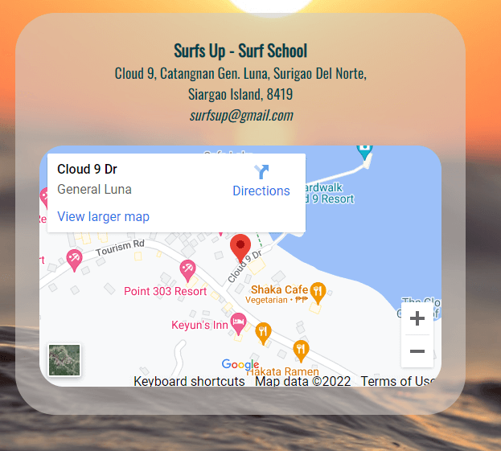
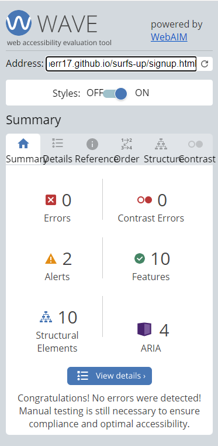

# Surfs Up
(Developer: Kieran Merrett)

[Live webpage](https://kiemerr17.github.io/surfs-up/index.html)

## Table of Content

1. [Project Goals](#project-goals)
    1. [User Goals](#user-goals)
    2. [Site Owner Goals](#site-owner-goals)
2. [User Experience](#user-experience)
    1. [Target Audience](#target-audience)
    2. [User Requrements and Expectations](#user-requrements-and-expectations)
    3. [User Stories](#user-stories)
3. [Design](#design)
    1. [Design Choices](#design-choices)
    2. [Colour](#colours)
    3. [Fonts](#fonts)
    4. [Structure](#structure)
    5. [Wireframes](#wireframes)
4. [Technologies Used](#technologies-used)
    1. [Languages](#languages)
    2. [Frameworks & Tools](#frameworks-&-tools)
5. [Features](#features)
6. [Testing](#validation)
    1. [HTML Validation](#HTML-validation)
    2. [CSS Validation](#CSS-validation)
    3. [Accessibility](#accessibility)
    4. [Performance](#performance)
    5. [Device testing](#performing-tests-on-various-devices)
    6. [Browser compatibility](#browser-compatability)
    7. [Testing user stories](#testing-user-stories)
8. [Bugs](#Bugs)
9. [Deployment](#deployment)
10. [Credits](#credits)
11. [Acknowledgements](#acknowledgements)

## Project Goals 

### User Goals
- Find a surf school in the Siargao area.
- See exactly what the business offers.
- Find information about the type of lessons available
- Find the location of the surf school

### Site Owner Goals
- See an increase in the number of customers.
- Provide information about the bussines to customers.
- Provide a way for new and existing customers to contact the buissnes.
- Promote the bussiness.

## User Experience

### Target Audience
- People looking for surf lessons in Siargao
- People looking for 1-2-1 surf coaching
- Groups of people looking for surf lessons
- Surfers looking to see the forecast for the surf this week.

### User Requrements and Expectations

- A easy and simple navigation system
- Easy access to relevant information
- All links and functions to work as expected
- A fully responsive design across all screen sizes
- Information about how to contact the business
- A design which is appealing to the eye

## User Stories

#### First-time User 
1. As a first time user, I want to know where the surf school is located
2. As a first time user, I want to know the type of training available
3. As a first time user, I want to know the history of the surf school
4. As a first time user, I want to get a feel for what to expect during my training

#### Returning User
5. As a returning user, I want to see the forecast for this weeks surfing
6. As a returnign user, I want to know the opening times
7. As a returning user, I want to be able to sign up to some surfing
8. As a returning user, I want to be able to email the company
9. As a returning user, I want to find the surf school on social media
10. As a returning user, I want to know who my instructors are
11. As a returning user, I want to get directions to the surf school

#### Site Owner 
12. As the site owner, I want users to be able to see photographic evidence of our training
13. As the site owner, I want users to know the history of the surf school
14. As the site owner, I want the users to be able to contact us or come for a visit

## Design

### Design Choices
The webpage was designed with a simplicity feel to give the user a quick and easy navigation to specific sections for relevant information.

### Colours
For the colour scheme i used sandy tones and deep blues to give the same feel you would expect to have being on a beach or in the water.tones were chosen to match the images on the page and also the colour theme of the actual restaurant. My inspiration for the colors was taken from a Pintrest colour pallet which i felt delivered just what i was looking for. The colors were given in basic '#' color codes but i converted them to RGB and RGBA to give some areas some opacity.
 

### Fonts
Oswald Font was used across the page to match in with the simplicity feel i was looking to acheive in the design period.
 
Sans-serif was used as a back-up font should Oswald not be available.

### Structure
The page is structured in a well know, recognizable, user friendly, and easy to learn way. When arriving to the website the user sees a familiar type of navigation bar with the company name on the left side and the navigation links to the right. 

The website consists of three separate pages: 
- A Home Page with a section to give information about the company, lesson types we offer and also the surf forecast for this week.
- A Gallery page with images to display content from previous lesson where photos were taken.
- A Sign Up page with a sign-up form, a map along with information about how and where to contact the business.

### Wireframes

Home Page

Gallery

Sign Up

## Technologies Used

### Languages
- HTML
- CSS

### Frameworks & Tools
- GitHub
- Gitpod
- Balsamiq
- Google Fonts
- Pintrest
- Font Awsome
- Favicon.io

## Features
The page consists of three pages and fourteen features

### Logo and Navigation Bar
- Featured across all three pages
- The navbar is fully responsive and changes to a toggler (hamburger menu) on smaller screens and includes
links to the Home Page, Gallery and Sign Up page
- This helps the user easily navigate through the pages
- The link for the page the user is currently on is underlined 

### About Us
- Alows users to see history of the surf school and about the surf instructors
- User stories covered: 3, 10, 13

### What We Offer
- Alowes users to see the type of traing lssons we offer.
- User stories covered: 2

### Surf Locations
- This gives the user a overlook for the week ahead surfing, its conditions (given in a start rating) and how many spaces are available for training that day.
- User stories covered: 5

### Footer
- Featured across all three pages
- It holds four seperate icons which link to social social media.
- User stories covered: 4, 9, 10, 12, 13

### Image Gallery
- Images take at the surf school during lessons
- User stories covered: 4, 12, 13

### Sign Up form
- A way for user to signup to the training we offer.
- User stories covered: 7

### Map
- Shows the surf schools location on a Google Map
- User stories covered: 1, 11 14

### Contact Us
- Gives the user information about the surf school including address, email, and opening times.
- User stories covered:1, 6, 8, 11, 14

Contact details are also displayed with a Google Map on the Sign Up page.

## Validation

### HTML Validation
The W3C Markup Validation Service was used to validate the HTML of the website. All pages pass with no errors no warnings to show.

Home Page

Gallery

Sign Up

 

### CSS Validation
The W3C Jigsaw CSS Validation Service was used to validate the CSS of the website. All pages pass with no errors no warnings to show.

Home Page

Gallery

Sign Up

 

### Accessibility
The WAVE WebAIM web accessibility evaluation tool was used to ensure the website met high accessibility standards. All pages pass with 0 errors. The alerts on the page are due to Home Page link being near the Link through the logo being in close proximity of oneanother.

Home Page

Gallery

Sign Up

 

### Performance 
Google Lighthouse in Google Chrome Developer Tools was used to test the performance of the website. 

Home Page

Gallery

Sign Up

 

### Performing tests on various devices 
I've tested my website on the following devices:
- Huawei Mate pad Pro (both in pc and tablet mode)
- Iphone 12
- Dell G3 Laptop

I also tested the site using Google Chrome Developer Tools, adjusting for all available devices.

### Browser compatability
The website was tested on the following browsers:
- Google Chrome
- Microsoft Egde

## Bugs

## Deployment
The website was deployed using GitHub Pages by following these steps:
1. In the GitHub repository navigate to the Settings tab
2. On the left hand menu select Pages
3. For the source select Branch: main
4. After the webpage refreshes automaticaly you will se a ribbon on the top saying: "Your site is published at https://kiemerr17.github.io/surfs-up/index.html"

## Credits

### Media
In order of apearance:
  
### Code

## Acknowledgements
I would like to take the opportunity to thank:
- My mentor Mo Shami for his advice, guidance and support.
- To Code Institute Slack members for providing support when needed.